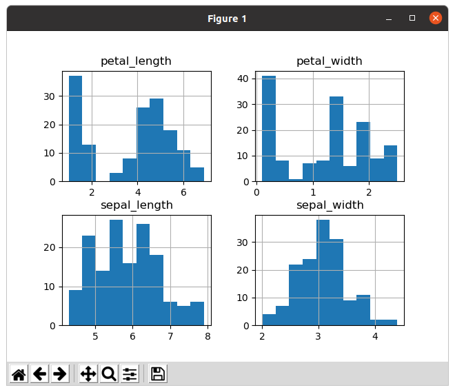
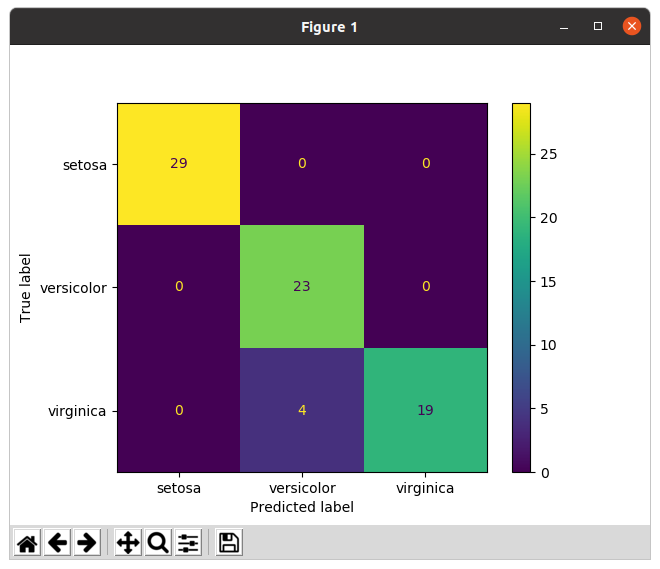
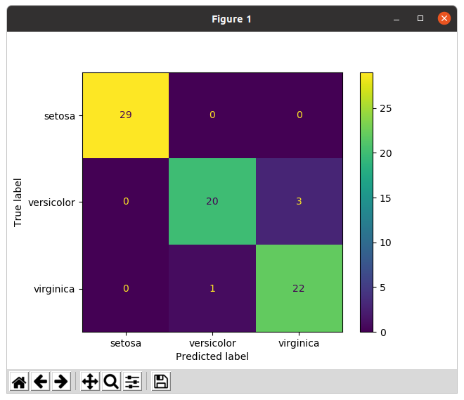

# Classifying Plants: Iris

This [MLHub](https://mlhub.ai) package uses the traditional iris
dataset to train a classification model to classify observations of
iris flowers into one of three species. The package demonstrates,
using Python, a number of typical steps undertaken by a data
scientist, including data exploration and visualisation, and model
building and evaluation. Multiple classification algorithms are used
to build the models. Their performance on the dataset is evaluated and
for two of the algorithms the evaluation of performance is further
delved into.

The canonical source for the data set is
<https://archive.ics.uci.edu/ml/datasets/Iris>. The CSV file used here
comes from <https://access.togaware.com/iris.csv>.

The package source code is available from
<https://github.com/gjwgit/pyiris>.


## Quick Start

```console
$ ml demo pyiris
```

## Usage

- To install mlhub (Ubuntu):

		$ pip3 install mlhub
		$ ml configure

- To install, configure, and run the demo:

		$ ml install   pyiris
		$ ml configure pyiris
		$ ml readme    pyiris
		$ ml commands  pyiris
		$ ml demo      pyiris
		
- Command line tools:

		TBA

## Command Line Tools

## Demonstration

```console
=============================================
Python Machine Learning with the Iris Dataset
=============================================

Welcome to a demo of bulding machine learning models using Python. The
well known iris dataset is used. The dataset contains 150 observations
of iris flowers. Each observation records the petal and sepal width
and length in centimeters. Also recorded for each observation is the
species of the flower, being one of setosa, versicolor, and virginica.

The dataset is read in from a CSV (comma separated values) file, as
can be readily found on the Internet. This one comes from
https://access.togaware.com/iris.csv.

Press Enter to continue: 

==================
Review the Dataset
==================

We review the dataset from the first 5 observations, the last 5 and
then a random sample of 5 observations. The numbers on the left are
the offsets of each observation, so they start at 0 for the first
observation and end at 149 for the 150th observation. Python natively
works with offsets rather than counts. If you are familliar with R
then you will know that R uses a count as the index rather and an
offset.

   sepal_length  sepal_width  petal_length  petal_width species
0           5.1          3.5           1.4          0.2  setosa
1           4.9          3.0           1.4          0.2  setosa
2           4.7          3.2           1.3          0.2  setosa
3           4.6          3.1           1.5          0.2  setosa
4           5.0          3.6           1.4          0.2  setosa

     sepal_length  sepal_width  petal_length  petal_width    species
145           6.7          3.0           5.2          2.3  virginica
146           6.3          2.5           5.0          1.9  virginica
147           6.5          3.0           5.2          2.0  virginica
148           6.2          3.4           5.4          2.3  virginica
149           5.9          3.0           5.1          1.8  virginica

     sepal_length  sepal_width  petal_length  petal_width     species
137           6.4          3.1           5.5          1.8   virginica
23            5.1          3.3           1.7          0.5      setosa
58            6.6          2.9           4.6          1.3  versicolor
130           7.4          2.8           6.1          1.9   virginica
21            5.1          3.7           1.5          0.4      setosa

Press Enter to continue: 

========================
Statisics of the Dataset
========================

A simple set of statistics gives some more insight into the data. Here
we see the count of the number of observations of each variable, the
mean value, standard deviation, and then the minimum and maximum
together with the three percentiles 25%, 50%, and 75%.

       sepal_length  sepal_width  petal_length  petal_width
count         150.0        150.0         150.0        150.0
mean            5.8          3.1           3.8          1.2
std             0.8          0.4           1.8          0.8
min             4.3          2.0           1.0          0.1
25%             5.1          2.8           1.6          0.3
50%             5.8          3.0           4.4          1.3
75%             6.4          3.3           5.1          1.8
max             7.9          4.4           6.9          2.5

Press Enter to continue: 

==========================
Identifying Missing Values
==========================

It is always good to check for missing values and to then determine
how they should be handled. In this dataset there are no missing
values but in most datasets we will find many. For each variable we
count the number of missing values.
               
sepal_length  0
sepal_width   0
petal_length  0
petal_width   0
species       0

Press Enter to continue: 

===============
Box and Wiskers
===============

A box and wiskers plot provides a quick visual insight into how the
values of each of the variables of the observations are distributed.
The box contains 50% of the values of the observations of the
variable.  The horizontal line within the box is the median value and
the notch represents a confidence interval around the mdeian. The top
and bottom bars show the minimum and maximum values, excluding
outliers, and extend to the other 25% up and 25% down of the
observations. Any points outside of  what is called the interquartile
range is an outlier.

Close the graphic window using Ctrl-W.
```

```console
Press Enter to continue: 

==========
Histograms
==========

A histogram provides a visual insight into the distribution of the
values of each of the observations of the variables. The x-axis
corresponds to the values of the variable whilst the y-axis is the
count.

Close the graphic window using Ctrl-W.
```

```console
Press Enter to continue: 

============
Scatter Plot
============

A scatter plot explores the distribution of the values  of two
variables, pair-waise over all variables. Do you see any patterns in
the data here?

Close the graphic window using Ctrl-W.
```

```console
Press Enter to continue: 

===============
Building Models
===============

It's time to build our machine learning models. The first task is to
build training and test datasets. As the names suggest, the training
dataset is used to train (build or fit) the model and the test dataset
is used to evaluate the performance of the model on otherwise unseen
observations.

The original dataset of 150 observations is randomly partitioned into
75 observations for the training dataset and 75 for the test dataset.

Typically, the training set will be 80% of the available data and the
testing dataset 20%.

Press Enter to continue: 

===============
Building Models
===============

We now build models that will take the training dataset of known
species and using the input variables (the flower dimensions) will fit
a model to identify the type of iris.

We will use 5 different algorithms to demonstrate, including CART,
LDA, KNN, NB, and SVM.

Note that the training set here is tiny, with few observations of few
variables, and so the task is not particularly challenging.

The table below reports on the models that have been fit and their
accuracy.  As is common the training dataset itself is split into 10
so-called folds, for a 10-fold cross-validation training paradigm.
Typically, 9 of the 10 folds will be used to fit the model and the
accuracy is calculated over the hold-out fold. This will be done 10
times to provide an average accuracy and its standard deviation for
each algorithm.

Model: Mean  Std
CART : 0.9 0.12
LDA  : 0.98 0.05
KNN  : 0.91 0.12
NB   : 0.92 0.1
SVM  : 0.94 0.1

Press Enter to continue: 

===============
KNN Performance
===============

We can delve into the model performance a little more, considering the
accuracy of the model on the test dataset, revieing the so-called
confusion matrix, and then a general performance report. These are
generated by applying the model to the test dataset that we held out
earlier.

Using this test dataset that has not otherwise been  used in building
the model provides an independent evaluation of the performance of the
model.

On the test dataset the KNN model's accuracy is 0.95 or 95%.

The confusion matrix is listed below as a numeric array and displayed
as a plot.  The rows correspond to the true classes and the columns
correspond  to the predicted classes. This provides a quick visual
evaluation of the accuracy of the model with respect to the different
classes.

[[29  0  0]
 [ 0 23  0]
 [ 0  4 19]]

Close the graphic window using Ctrl-W.
```

```console
Press Enter to continue: 

=====================
Classification Report
=====================

The following is then a summary report on the performance of the model
on the test data.

We often talk in terms of true/false positives/negatives, abbreviated
respectively TP, FP, TN, FN. TP is then the number of positive
observations (e.g., setosa) that are actually positive observations
(i.e., setosa). Similary for the others.

Precision is a measure of how accuracte the model is on predicting the
class or TP/(TP+FP).

Recall is a measure of how many actual observations in this class were
predicted to be in this class or TP/(TP+FN).

The F1-score is the proportion of the predictions for a specific class
that are actually correct or 2*Re*Pr/(Re+Pr).

Support is the number of occurences of each class.

              precision    recall  f1-score   support

      setosa       1.00      1.00      1.00        29
  versicolor       0.85      1.00      0.92        23
   virginica       1.00      0.83      0.90        23

    accuracy                           0.95        75
   macro avg       0.95      0.94      0.94        75
weighted avg       0.95      0.95      0.95        75

Press Enter to continue: 

Similarly on the test dataset with the CART (decision tree) model the
accuracy is 0.93 or 93%.

The confusion matrix and plot are similar.

[[29  0  0]
 [ 0 20  3]
 [ 0  2 21]]

Close the graphic window using Ctrl-W.
```

```console
Press Enter to continue: 

=====================
Classification Report
=====================

              precision    recall  f1-score   support

      setosa       1.00      1.00      1.00        29
  versicolor       0.91      0.87      0.89        23
   virginica       0.88      0.91      0.89        23

    accuracy                           0.93        75
   macro avg       0.93      0.93      0.93        75
weighted avg       0.93      0.93      0.93        75

Press Enter to continue: 

```
